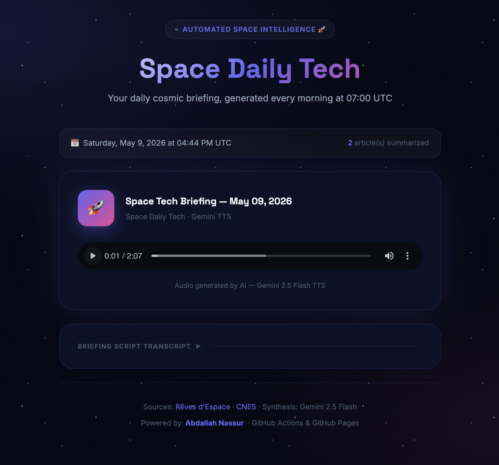

# Space Daily Tech 🚀

<p align="center">
  
</p>

> **Your daily morning space technology briefing**, automatically fetched, translated, synthesized in English, and read aloud by an advanced Gemini AI — every morning at 07:00 UTC.

[🌐 Live Demo](https://nassabd.github.io/space-daily-tech/)

---

## 🛰️ How it works

```
CNES RSS Feed & Rêves d'Espace HTML Scraping
                      │
                      ▼
BeautifulSoup & feedparser — filters articles within the last 24 hours
                      │
                      ├─► [Slow Day Fallback] Grab absolute latest of both if 0 new articles
                      │
                      ▼
Gemini 2.5 Flash — translates, summarizes and synthesizes into a radio host script (EN)
                      │
                      ▼
Gemini TTS — speech synthesis → audio/latest_report.wav
                      │
                      ▼
data.json — stores date, title, summary, article count
                      │
                      ▼
GitHub Pages — index.html loads data.json and streams the cosmic podcast!
```

---

## ⚙️ Initial Setup

### Step 1 — Fork / Clone this repository

```bash
git clone https://github.com/<YOUR-USERNAME>/space-daily-tech.git
cd space-daily-tech
```

### Step 2 — Configure Secrets in GitHub Actions

1. Get a Google Gemini API Key from **[aistudio.google.com/apikey](https://aistudio.google.com/apikey)**.
2. In your GitHub repository, go to **Settings → Secrets and variables → Actions**.
3. Create the following Secrets under **Repository secrets**:

| Secret Name | Description |
|-------------|-------------|
| `GEMINI_API_KEY` | Your Google Gemini API Key |
| `MAIL_USERNAME` | SMTP server sender username (e.g., your email) |
| `MAIL_PASSWORD` | SMTP server app-specific password |
| `MAIL_TO` | Recipient email address to receive deployment notifications |

### Step 3 (Optional) — Custom Variables

In **Settings → Secrets and variables → Actions → Variables**, you can add:

| Variable | Default Value | Description |
|----------|---------------|-------------|
| `TTS_VOICE_NAME` | `Charon` | Speech voice: `Charon` (M), `Kore` (F), `Aoede` (F), `Lede` (F) |
| `MAX_ARTICLES` | `10` | Maximum number of articles to aggregate |
| `RSS_FEED_URL` | `https://cnes.fr/rss/actualites` | Optional custom feed URL for CNES RSS |
| `TOPIC_NAME` | `Space Tech` | The topic display title shown on the frontend player |

### Step 4 — Enable GitHub Pages

1. In your repo, go to **Settings → Pages**.
2. Under **"Source"**, select **"Deploy from a branch"**.
3. Select the **`main`** branch and the **`/ (root)`** folder.
4. Click **"Save"**.

---

## 🚀 Manual Generation

To force generate a briefing immediately without waiting for the 07:00 UTC cron schedule:

1. Click on the **Actions** tab.
2. Select **"Space Daily Tech — Daily Briefing"**.
3. Click **"Run workflow"** → **"Run workflow"**.

---

## 🛠️ Local Development

### Prerequisites
- [uv](https://docs.astral.sh/uv/) installed

### Installation

```bash
# Sync local virtual environment dependencies
uv sync --all-groups

# Copy and edit local environment configurations
cp .env.example .env
```

### Execution

```bash
# Production mode (calls Gemini APIs)
uv run python scripts/main.py

# Offline mode / mock dry-run (generates data.json without API calls)
uv run python scripts/main.py --dry-run
```

### Type Checking & Lints

```bash
# Verify static type assertions
uvx ty check scripts/main.py

# Run style formatter
uvx ruff check scripts/
```

### Testing

```bash
# Run complete TDD test suite
PYTHONPATH=. uv run python -m pytest
```

---

## 📝 License

MIT — Free and open source software.
